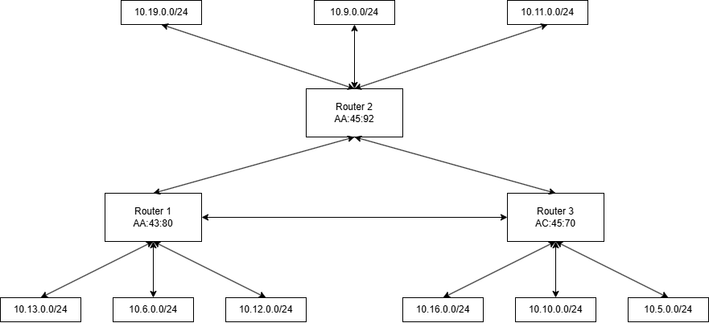

# Redes de Computadoras - Trabajo Práctico N°1

### Grupo: WAN-PIECE
### Profesores
- Santiago Martin Henn
- Facundo Nicolas Oliva Cuneo

### Integrantes

| Nombre                  | Correo Electrónico              | 
|-------------------------|---------------------------------|
| Benavides María Candela |                                 |
| Fariñas Rafael          |                                 |
| Melia Nicolas           |                                 |
| Salinas Joaquín         |joaquin.salinas.874@mi.unc.edu.ar|

## 1. Identificación de dispositivos y armado de la topología
En el marco del laboratorio, nuestro grupo representó al Router 3, identificado con la dirección MAC  AC:45:70. La función nuestra como router consistía en el reenvío de paquetes entre redes, operando nodo a nodo de interconexión. Según la topología, el Router 3 se encontraba conectado directamente a:
- Router 1 (AA:43:80) y Router 2 (AA:45:92), con quienes intercambió información de ruteo y realizó el proceso de ARP para descubrir sus MACs
- Las redes 10.16.0.0/24, 10.10.0.0/24 y 10.5.0.0/24, que tenía conectadas directamente.

El objetivo general del laboratorio fue simular de manera física el comportamiento de una red IP real en la que  cada participante asumió la identidad de un dispositivo de red y se siguió el proceso completo de envió de paquetes, desde que un host origen construye su frame Ethernet hasta que el paquete llega al host destino.

> Fig 1. Diagrama de topología de red

## 2. Armado de topología
Una vez armada la topología, cada router construyó su tabla de ruteo indicando, para cada red destino, si estaba conectada directamente a una de las interfaces o si se debía reenviar el paquete hacia otro router (next hop).

| Red Destino    | Next Hop          | 
|----------------|-------------------| 
|  10.16.0.0/24  | Conexión directa  |
|  10.10.0.0/24  | Conexión directa  |
|  10.5.0.0/24   | Conexión directa  |
|  10.13.0.0/24  | Router 1          |
|  10.6.0.0/24   | Router 1          |
|  10.12.0.0/24  | Router 1          |
|  10.19.0.0/24  | Router 2          |
|  10.9.0.0/24   | Router 2          |
|  10.11.0.0/24  | Router 2          |

> Tabla de ruteo

## 3 y 4.Conformación de paquetes y simulación de transmiciónes y recepciones
Nuestro grupo al ser Router, no generamos paquetes, nuestra función era reenviar los paquetes que nos llegaban. Por cada paquete recibido se realizaba el siguiente proceso.
1. Se recibía el frame Ethernet entrante, con MAC destino correspondiente a nuestra interfaz (AC:45:70).
2. Se desencapsuló el frame y se examinó el paquete IP anterior.
3. Se decrementó el TTL en 1.
4. Se consultó la tabla de ruteo para determinar el siguiente salto según la IP destino.
5. Se resolvió mediante ARP la MAC del siguiente salto.
6. Se reencapsuló el paquete IP en un nuevo frame Ethernet con la nueva MAC destino y MAC origen AC:45:70, y se reenvió.

## 5. Reflexiones y documentación
a. La IP destino se mantiene constante mientras que la MAC cambia en cada salto debido a que son dos niveles de direccionamiento con propósitos distintos. La IP identifica al destino final de extremo a extremo y no tiene por qué cambiar en ningún momento del recorrido. Por otro lado, la MAC es un direccionamiento físico que solo tiene sentido dentro de un enlace local, es decir, cada vez que el paquete pasa de un router al siguiente, se construye un frame nuevo para ese tramo específico, con las MACs de los dos dispositivos que están en ese enlace.
b. El host busca la MAC del gateway porque ARP solo funciona dentro de la misma red local. Un host no puede enviar un ARP request a una red remota, ese broadcast no cruza routers. Entonces lo que hace es mandarle el paquete a su gateway, que sí está en su misma LAN y cuya MAC puede resolver.
c. El modelo de ruteo hop-by-hop tiene como ventaja que cada router solo necesita conocer su entorno inmediato, no el mapa completo de Internet, haciendo que la red sea escalable: si cambia una ruta en algún lado, solo se actualizan los routers afectados, no todos. A su vez, permite redundancia, ya que si un camino cae, cada router puede redirigir por otro sin que el resto de la red lo sepa.
d. Es necesario reconstruir el frame Ethernet en cada salto ya que tiene alcance local, es decir, que la función es entregar el paquete en un tramo específico entre dos dispositivos directamente conectaods. Una vez que el paquete llega al router destino, ese frame se descarta y el router construye frame Ethernet para el siguiente tramo, con las MACs correspondientes a ese enlace.
Si un router intentara reenviar exactamente el mismo frame, la MAC destino seguiría siendo la suya propia y ningún otro dispositivo la aceptaría o llegaría a un dispositivo equivocado.
e. El campo TTL previene que un paquete quede circulando indefinidamente en la red. Se podría dar el caso en el cuál por error las tablas de ruteo formen un ciclo y el paquete quedaría rebotando para siempre consumiendo ancho de banda. Con ayuda del campo TTL, cada router lo decrementa en 1 y cuando llega a 0 el paquete se descarta y se notifica al origen. Sin este mecanismo, un solo ciclo de ruteo mal configurado podría satura enlaces enteros con paquetes que nunca llegan a destino.
